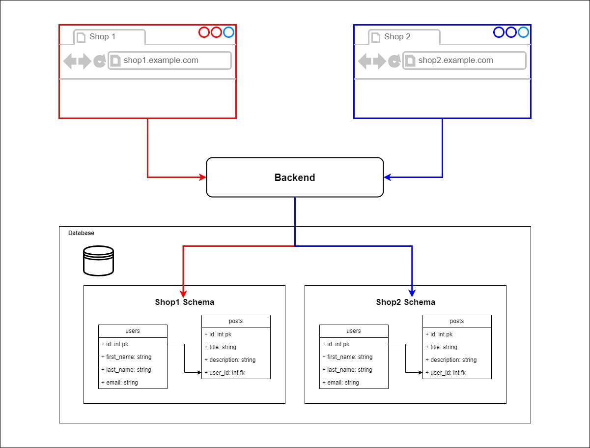

## Multi-Tenant App with Express and Prisma

This project demonstrates a simple multi-tenant application using Node.js and Prisma, allowing different clients to use separate subdomains and databases.

Youtube Tutorial: [Build a Multi-Tenant app with NodeJS and Prisma](https://youtu.be/RA5x1sEmJGo?si=D7P9X6FR8oqnzcai)

This uses subdomains (e.g., `shop1.loc:8000`, `shop2.loc:8000`) to identify tenants.Express server requests to tenant-specific schemas in a PostgreSQL database. Prisma manages these schemas, selecting the correct one based on the subdomain. The app extracts the tenant identifier from the request's host header using a prefix function. API endpoints include `GET /api/products` to retrieve products and `POST` to the same endpoint to create new products for each tenant. This design ensures data isolation between tenants for adding new ones.
